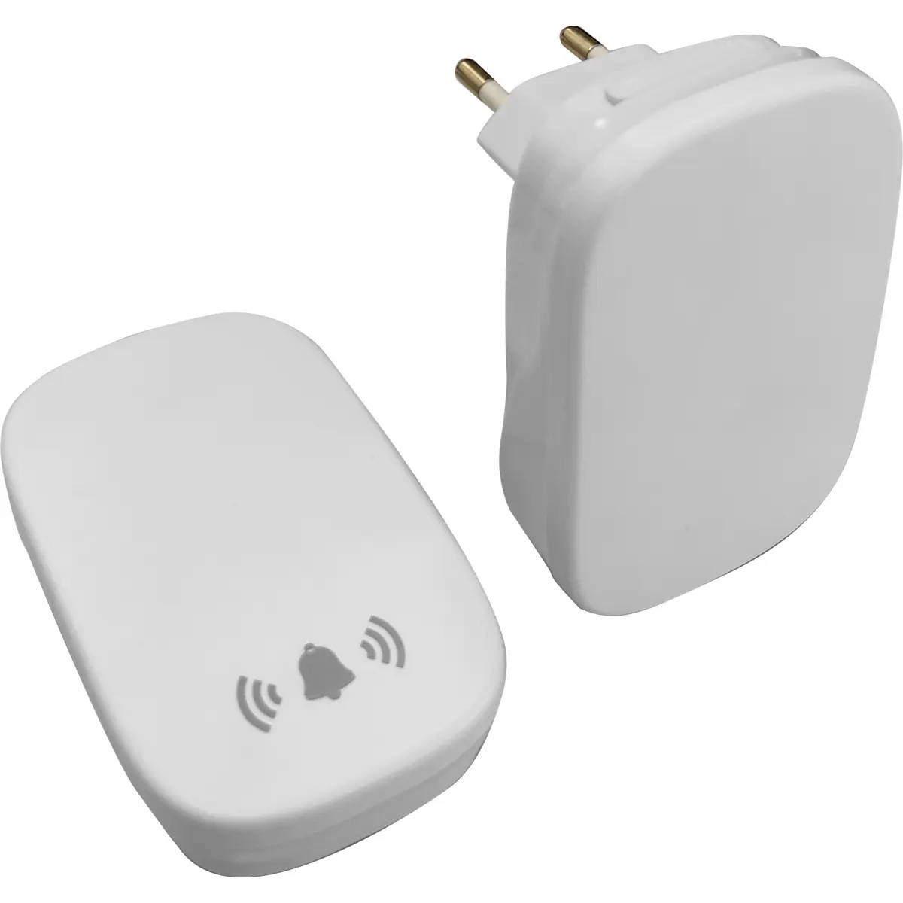
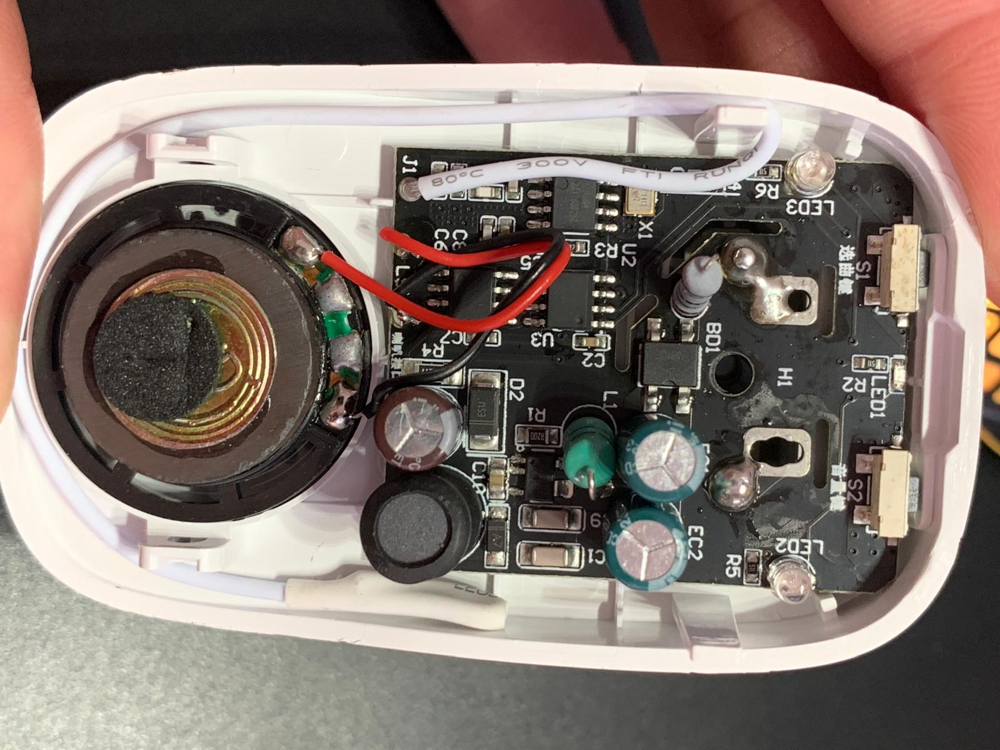
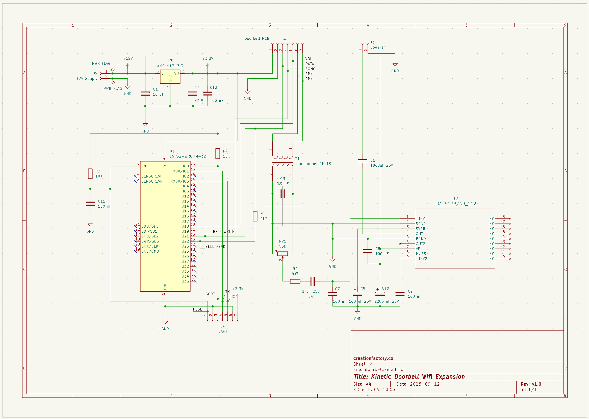
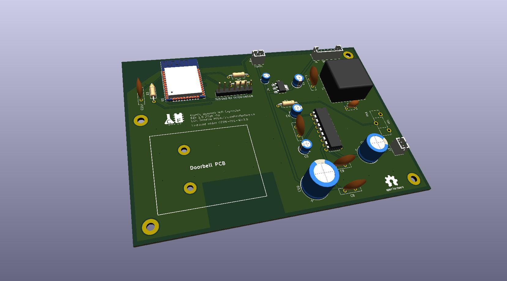
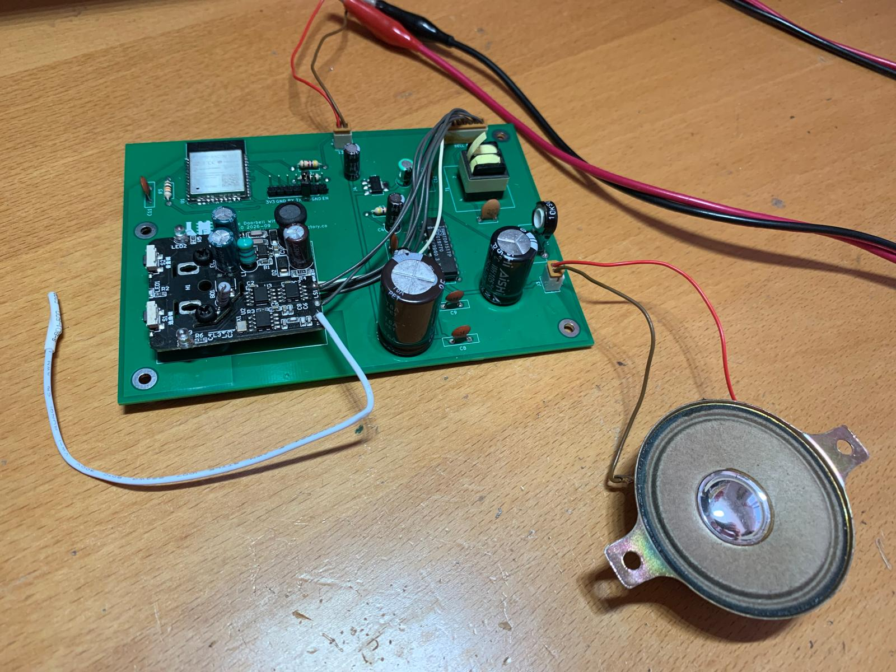

# Kinetic Doorbell Wifi Expansion

## Overview

This project appeared from the need for connecting a kinetic doorbell to my home automation.

This doorbell solution appealed me for not requiring power on the transmitter side 
(the doorbell button sitting outside), as it relies on the kinetic energy of the user 
pressing the button. The experience is of clicking a button with slightly more travel amplitude 
than usual, but comparable to pressing a traditional wired doorbell button (e.g. Legrand push 
button).

Like I had previously done with another doorbell (this time a battery powered one - CR2032 
coin cell), the first thing I tried was leveraging a modified Sonoff RF Bridge (flashed with
Tasmota on the ESP8266 and Portisch firmware on the radio decoder chip), in order to capture 
the transmitted frames and feed MQTT events into my home automation.

However I learned that the frames sent by the kinetic transmitter are too short (power budget
constraints are a very likely factor here) for the RF baseband and/or decoder chip to detect,
therefore preventing my existing setup from be used here.

Then, given my interest in getting these events, I decided to pursuit another route: instead
of trying to capture the radio signal independently, I have chosen to focus on the doorbell
receiver and see if I could come up with a hardware solution.

## Solution

### Partial reverse-engineering

As I was investigating the doorbell receiver, I could tell that the functions in this board 
were well divided in 3 different 8-pin chips: one being the RF receiver, clealy identifiable by the
27.1412 MHz crystal next to it. While the labels in the package don't have any obvious part
correspondence (it has only the indications 004 2342d00252), there is a strong probability
of being the CMT2210LH 433 MHz OOK/ASK receiver:

Then there is what apparently is the microcontroller where probably the raw (digital) signal 
discriminated by the radio chip, is decoded into recognizable frames, and (as I latter learned) 
where the bitstream containing the sequence of sounds to be played is stored and played. 
By tapping into the output pins, I could see this flow of bits being output while the 
sound / melody was being played.

Lastly the audio chip, which appears to be a combination of FM (or similar synthesis function)
and analog audio production and amplification. Two of the pins of this last 8-pin chip, are
connected directly to the small built-in speaker.

Conveniently, in the back of the receiver PCB there were test pads allowing access to all of these
relevant signals, and also the speaker pins.

### My expansion board

With these findings I had more than enough material for my goal. Having a signal that changes
when the melody starts playing, would be a solid indication that someone had pressed the 
doorbell button. Also, I could go a bit further by taking into consideration that I could 
also tap into the song selection and volume buttons, allowing me to also control these 
via software.

As such, I went on to build a board allowing me to:

 * power the doorbell original PCB and the expansion board itself. The doorbell originally
operated at 5 Volts but by testing, I could tell that it was equally happy running at 3.3 Volts.
For my design this was a major difference, because it meant a substantial saving in components
and complexity;
 * allow events from the doorbell to be mediated into the home automation via an ESP32
microcontroller;
 * control the playback, volume and song selection through the ESP32;
 * nice to have - inject my own sequences, creating new melodies / sounds (TBD);
 * have a more powerful speaker and audio output through the addition of an external audio OPAMP.

With this in mind, so I went. Keeping the design simple while allowing for providing the functions
described above.

#### Project

The board consists of an ESP32-WROOM-32 module, a 3.3 Volt linear regulator (to drop the +12V supply
to the 3.3V required by the ESP32 and the doorbell PCB), and a 6 Watt audio amplifier. For the 
regulator I have chosen the common AMS1117 low dropout chip, whereas for the audio opamp, I have
selected the TDA1517P chip. The reason for choosing the latter was because I had a few of these in
stock, and is a basic yet decent amplifier. It is a stereo chip, but in this project I am only using
one of the two channels.

Because I didn't want to limit the board's purpose in the future, I decided to leave all the relevant 
taps (volume control, song control, and audio bitstream), all tied to GPIO ports in the ESP32 chip. 
For the audio bitstream, I have assigned two GPIO's in order to achieve bidirectional interaction with 
the chip.

For the audio, because I found the output that goes to the original speaker, to be a PWM signal 
modulated with a 128 KHz carrier (basically we are dealing with a class D audio amplifier), I could not
feed it directly to the linear audio OPAMP. The carrier signal had to be filtered first. As such
I have chosen to use a 1:1 audio transformer, together with an RC network on the transformer
secoondary in order to provide a clean signal to the OPAMP input.

In order to control the volume level (depending on where this module is placed, max volume can easily become too unpleasant), I have added a 100 K potentiometer.

This board requires a 12 Volts supply because of the audio amplifier. It can be jacked up to
15 Volts, but more than that should be avoided because of the AMS1117 input voltage limits.
More voltage will of course mean potentially higher amplitude in the speaker, therefore
implying more intense audio.

#### Assembled hardware

I left space in the board design for mounting the small doorbell PCB as daughter board,
in order to slighly simplify the mechanical design, and to keep the connections between the
two boards in close proximity.

There is a 7 pin header for programming and/or debugging (serial log) the ESP32 chip.
The initial programming entirely depends on it because of the absence of any pre-programmed
code to update the firmware via Wifi.

## Sample code

In the `doorbell.be` file you may find a small script that all it does is to engage the 
song selection and volume keys, and also has experimental logic to inject a stream of
pulses into the audio chip, in an attempt to understand its protocol.

## Future steps

While it poses some challenges, one interesting idea for this project is to tackle the
audio bitstream, and be able to produce custom songs via the ESP32 chip. However the 
effort / reward relationship needs to be put into the equation, considering the numerous
(and well known) hardware solutions available for the same result.

In my perspective it is more interesting for the fun of reverse engineering that feature,
than the concrete added value of achieving it.

## Included materials

In this project you can find the Tasmota / Berry source code for the test script I mentioned, 
as well as in the hardware/cad/doorbell section, the schematic and CAD drawings. There are
also a few footprint customizations.